# 🦠 COVID-19 Data Analysis: India & Global Insights

<div align="center">


**An end-to-end data analysis project covering COVID-19 spread, vaccination rollout, and testing patterns across India (all states) and 226 countries worldwide.**

[📓 View Notebook](#-project-notebook) · [📊 Key Visualizations](#-key-visualizations) · [💡 Key Insights](#-key-insights) · [🚀 Quick Start](#-quick-start)

</div>

---

## 📌 Project Overview

This project demonstrates a complete, real-world data analysis workflow — from raw messy CSVs to professional insights. Built as a portfolio project for data analyst job applications.

**What this project covers:**
- State-wise COVID-19 impact analysis across all Indian states
- Wave 1 vs Wave 2 (Delta) intensity comparison with peak detection
- Vaccination rollout tracking — doses, brands, state coverage
- Test positivity rate benchmarked against WHO safety thresholds
- India vs major global countries daily case comparison

---

## 📊 Datasets Used

| Dataset | Rows | Description | Source |
|---------|------|-------------|--------|
| `covid_19_india.csv` | 18,110 | Daily state-wise confirmed, deaths, recoveries | Kaggle |
| `covid_vaccine_statewise.csv` | 7,845 | State-wise vaccination by dose, gender, brand | Kaggle |
| `StatewiseTestingDetails.csv` | 16,336 | State-wise PCR testing records | Kaggle |
| `worldometer_coronavirus_daily_data.csv` | 184,787 | Global daily data — 226 countries | Kaggle |

**Total records analyzed: 226,000+**

> 📥 Download all datasets from: [COVID-19 in India — Kaggle](https://www.kaggle.com/datasets/sudalairajkumar/covid19-in-india)

---

## 🗂️ Project Structure

```
covid19-analysis/
│
├── data/
│   ├── raw/                          ← Original downloaded CSVs (do not edit)
│   │   ├── covid_19_india.csv
│   │   ├── covid_vaccine_statewise.csv
│   │   ├── StatewiseTestingDetails.csv
│   │   └── worldometer_coronavirus_daily_data.csv
│   └── cleaned/                      ← Processed files (auto-generated)
│       ├── india_clean.csv
│       ├── vaccine_clean.csv
│       ├── testing_clean.csv
│       └── world_clean.csv
│
├── outputs/
│   └── charts/                       ← All 11 generated visualizations (PNG)
│
├── COVID19_Analysis.ipynb            ← Main notebook — run this
├── requirements.txt
└── README.md
```

---

## 🚀 Quick Start

### 1. Clone the repository
```bash
git clone https://github.com/Talharehman421/covid19-data-analysis.git
cd covid19-data-analysis
```

### 2. Install dependencies
```bash
pip install -r requirements.txt
```

### 3. Add the datasets
Download the 4 CSV files from Kaggle and place them inside `data/raw/`

### 4. Set your project path
Open `COVID19_Analysis.ipynb` and edit **Cell 2**:
```python
PROJECT_ROOT = r"C:\Users\YourName\Desktop\covid19-analysis"  # ← change this
```

### 5. Run the notebook
```bash
jupyter notebook COVID19_Analysis.ipynb
```
Run all cells top to bottom. All 11 charts will auto-save to `outputs/charts/`.

---

## 📦 Requirements

```
pandas>=1.5.0
numpy>=1.23.0
matplotlib>=3.6.0
seaborn>=0.12.0
jupyter>=1.0.0
nbformat>=5.7.0
```

Install all at once:
```bash
pip install pandas numpy matplotlib seaborn jupyter
```

---

## ❓ Business Questions Answered

| # | Question | Chart |
|---|----------|-------|
| 1 | Which Indian states were most severely impacted? | Chart 1 |
| 2 | How did Wave 1 vs Wave 2 differ in intensity & timing? | Chart 2 |
| 3 | Which states had the highest fatality & recovery rates? | Chart 3 |
| 4 | What was the monthly case progression pattern? | Chart 4 |
| 5 | How did the national vaccination rollout progress? | Chart 5 |
| 6 | Which states had the highest & lowest dose-2 coverage? | Chart 6 |
| 7 | How did testing volume and positivity rate change over time? | Chart 7 |
| 8 | Which states had critical test positivity rates (>10%)? | Chart 8 |
| 9 | Which countries had the highest cases and fatality rates? | Chart 9 |
| 10 | What did the global wave pattern look like? | Chart 10 |
| 11 | How did India's daily cases compare to major countries? | Chart 11 |

---

## 📈 Key Visualizations

### Chart 1 — Top 10 Most Affected Indian States
> Maharashtra leads in both confirmed cases (~25% of national total) and deaths.

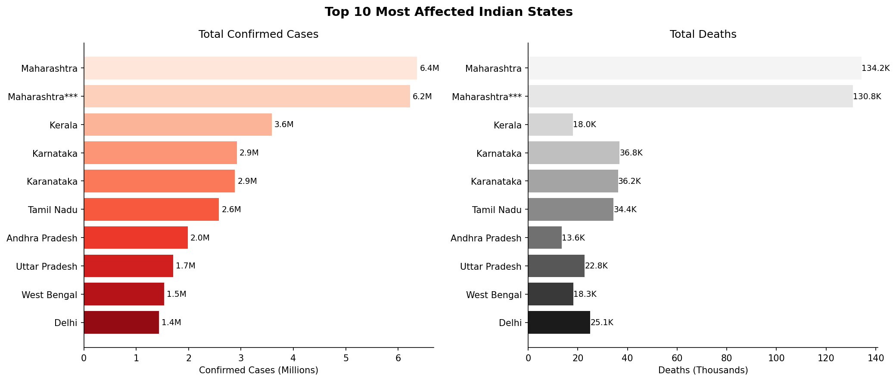

---

### Chart 2 — India National Trend & Wave Detection
> Wave 2 (Delta) was approximately 3× more intense than Wave 1 in peak daily cases.

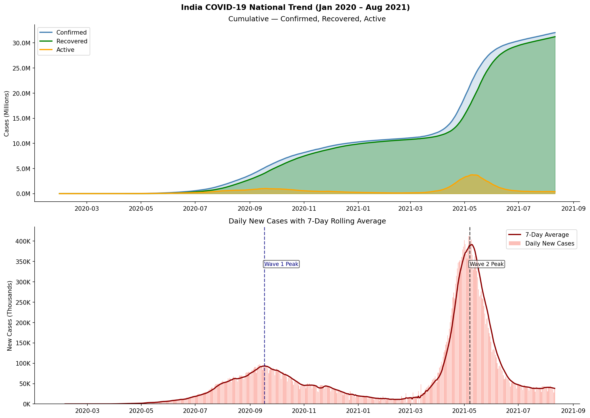

---

### Chart 3 — Fatality & Recovery Rate Heatmap
> Punjab and Uttarakhand had disproportionately high fatality rates; Kerala led in recovery.

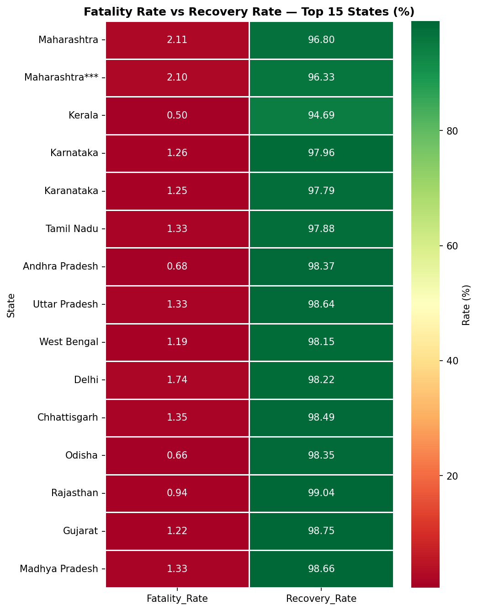

---

### Chart 4 — Monthly Case Progression Heatmap
> Two-wave structure clearly visible; Apr–May 2021 shows simultaneous spike across all states.

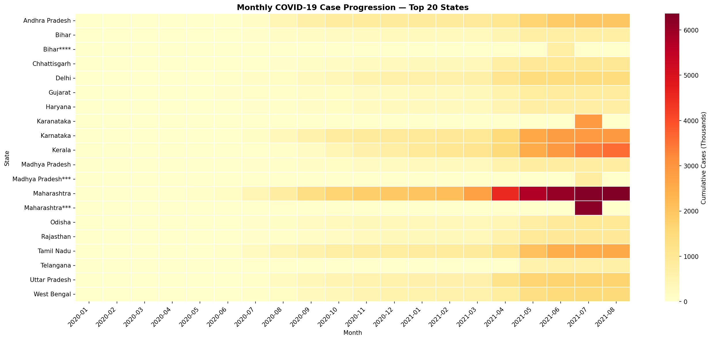

---

### Chart 5 — National Vaccination Rollout & Brand Share
> CoviShield dominated ~85% of all doses. Dose 2 lagged Dose 1 due to supply constraints.

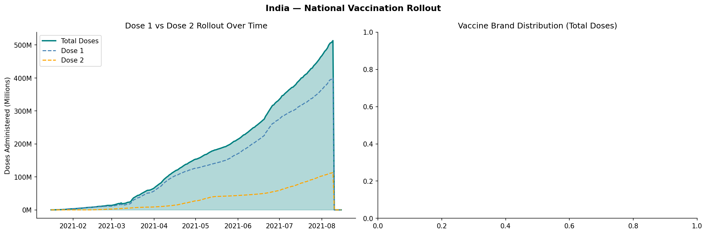

---

### Chart 6 — State-wise Dose 1 vs Dose 2 Coverage
> Only ~35% of Dose 1 recipients had completed Dose 2 by July 2021.

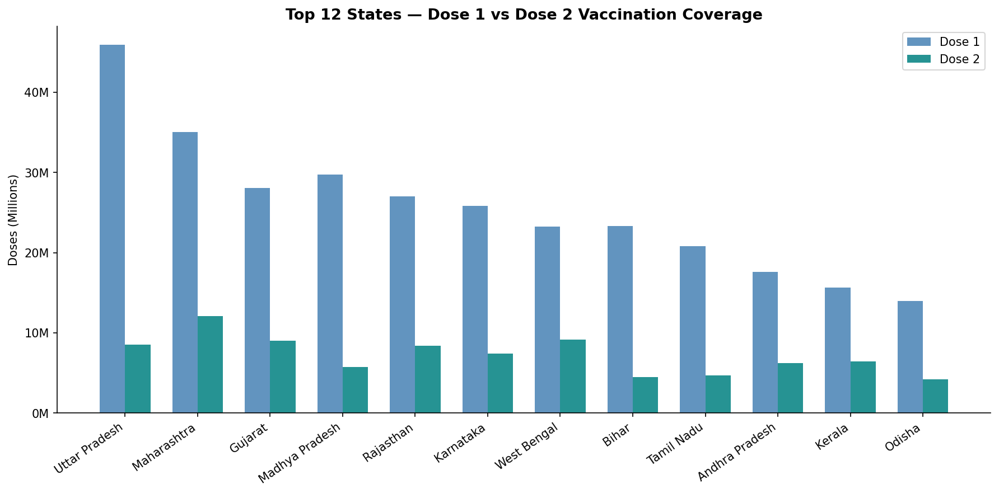

---

### Chart 7 — Testing & WHO Positivity Threshold
> Positivity exceeded the WHO 5% safe threshold during both waves; Wave 2 hit 20%+.

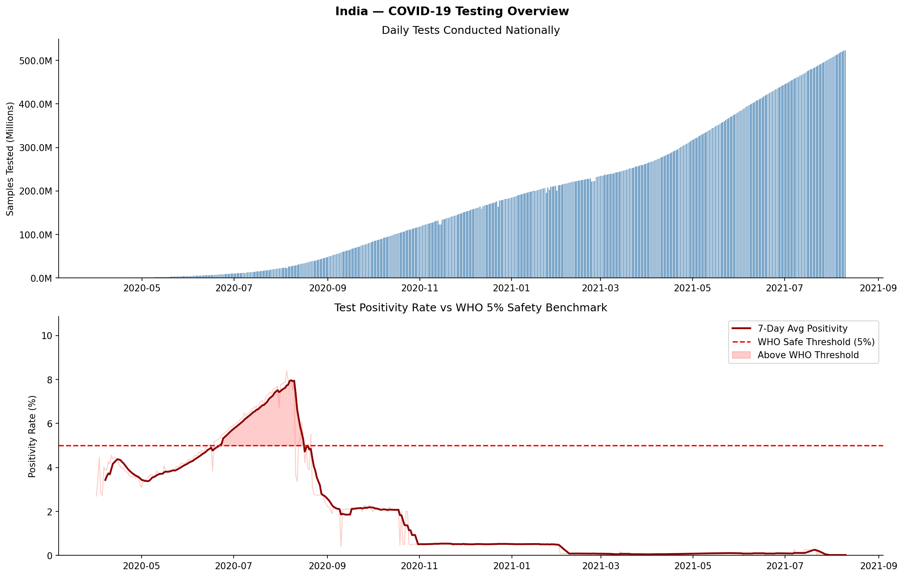

---

### Chart 8 — State-wise Test Positivity Rate
> States exceeding 10% positivity had severely undercounted actual infections.

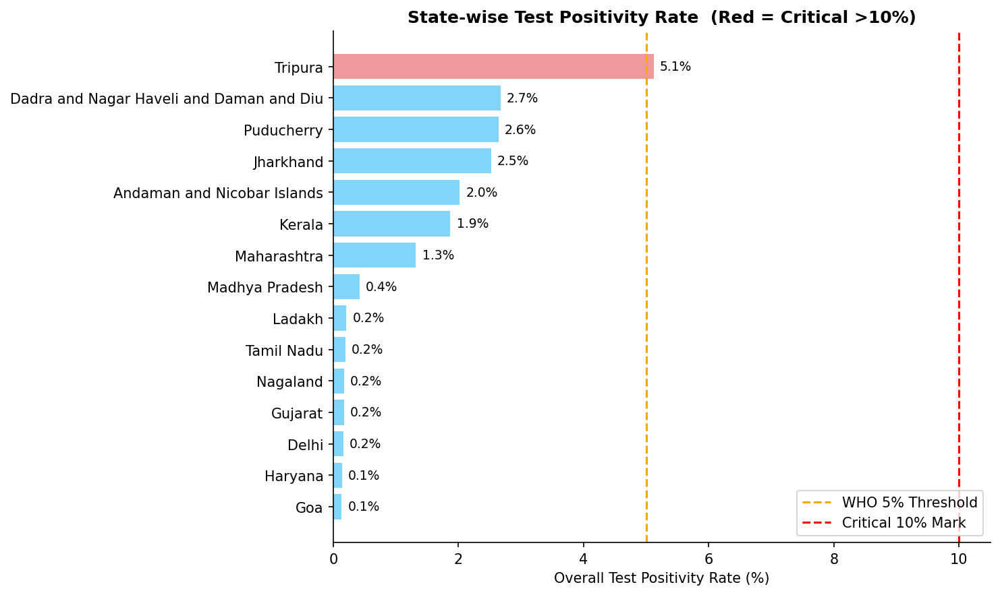

---

### Chart 9 — Global Top 10 + Fatality Bubble Chart
> USA led in absolute cases. High case count does not equal high fatality rate.

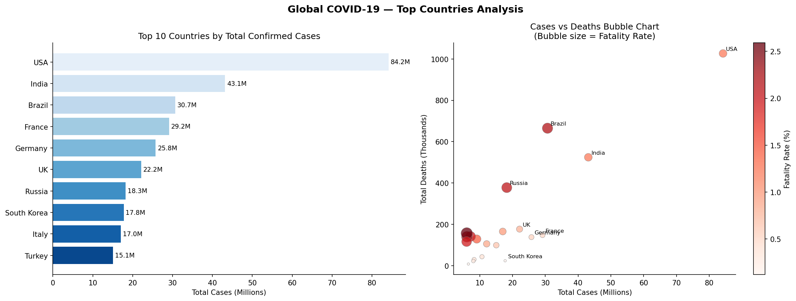

---

### Chart 10 — Global Daily Trend (All Waves)
> Omicron (Jan 2022) generated ~5× more cases than the Delta peak, but deaths did not scale.

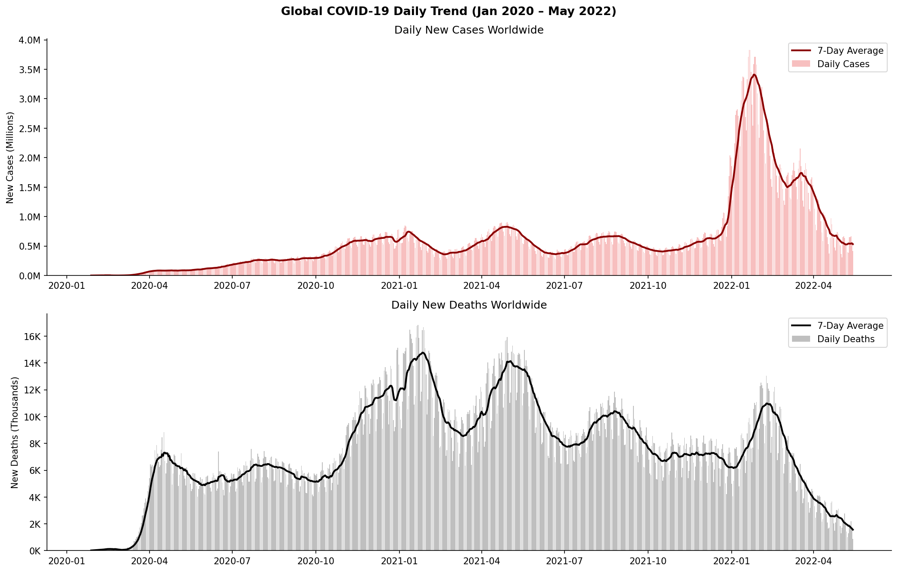

---

### Chart 11 — India vs Major Countries
> India briefly overtook the USA in daily new cases during the Delta wave (Apr–May 2021).

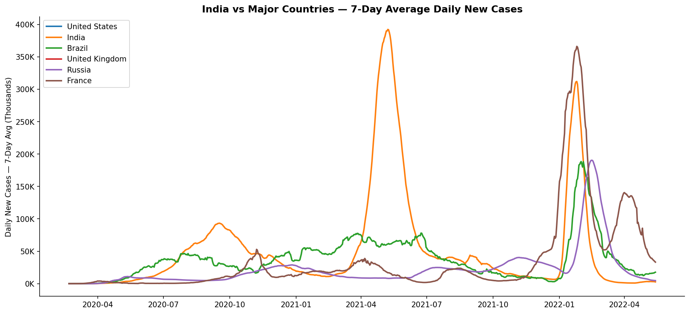

---

## 💡 Key Insights

### 🇮🇳 India
- **Maharashtra** was the most severely hit state, accounting for ~25% of national cases
- **Wave 2 (Delta, Apr–May 2021)** was ~3× more intense than Wave 1 at peak
- **Punjab & Uttarakhand** had the highest fatality rates relative to case load
- **Kerala** achieved the best recovery rates despite high confirmed case volumes
- Only **~35% of Dose 1 recipients** had completed Dose 2 by July 2021
- **CoviShield accounted for ~85%** of all vaccine doses administered in India

### 🧪 Testing
- Test positivity exceeded the WHO 5% safety threshold during **both waves**
- Wave 2 peak positivity hit **20%+** — actual infections were likely **4–5× the official count**

### 🌍 Global
- USA, India, and Brazil together accounted for **~40% of global confirmed cases**
- **Omicron** produced ~5× more daily cases than Delta but with significantly lower fatality — evidence of vaccine-induced immunity reducing severity

---

## 📋 Recommendations

| # | Recommendation | Rationale |
|---|----------------|-----------|
| 1 | Scale Dose 2 campaigns in states with large Dose 1–Dose 2 gaps | Only ~35% completion rate by mid-2021 |
| 2 | Increase testing in high-positivity states | >10% positivity = severely undercounted burden |
| 3 | Targeted healthcare investment in Punjab & Uttarakhand | Disproportionately high fatality rates |
| 4 | Deploy real-time positivity dashboards | Early warning for future wave detection |

---

## 🛠️ Technical Approach

| Stage | Technique |
|-------|-----------|
| **Data Ingestion** | `pd.read_csv()` with shape/dtype inspection |
| **Cleaning** | Type casting, null forward-fill, duplicate removal, derived column creation |
| **EDA** | Aggregations via `groupby`, `pivot_table`, rolling averages |
| **Visualization** | `matplotlib` subplots, `seaborn` heatmaps, bubble scatter, pie charts |
| **Time-Series** | 7-day rolling average for smoothed trend lines, peak detection via `idxmax()` |
| **Benchmarking** | WHO 5% positivity threshold plotted as reference line |

---

## 👤 Author

**Talha Rehman**  
M.Sc. Bioinformatics, Pondicherry University

[](https://github.com/Talharehman421)
[](https://linkedin.com/in/talha-rehman-532342212)

---

## 📄 License

This project is licensed under the MIT License — see the [LICENSE](LICENSE) file for details.

---

<div align="center">
⭐ If you found this project useful, please consider giving it a star!
</div>
